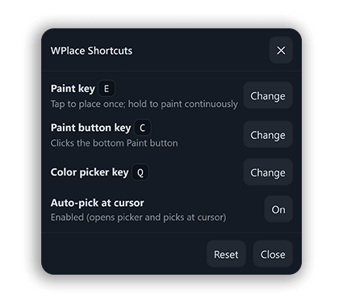

## wplace-shortcuts

[](https://github.com/z1xus/wplace-shortcuts/releases)
[](https://github.com/z1xus/wplace-shortcuts/issues)
[](https://github.com/z1xus/wplace-shortcuts/pulls)

Userscript that adds configurable shortcuts to `wplace.live`.



### Usage

1. Install a userscript manager (e.g. [Tampermonkey](https://www.tampermonkey.net/), [Violentmonkey](https://violentmonkey.github.io/)).
2. Install the latest `.user.js` from the [Releases](https://github.com/z1xus/wplace-shortcuts/releases) page.
3. Visit `https://wplace.live` — the script loads automatically.
4. Open the userscript menu → “Open settings”. Press a key to set each binding.

Defaults:
- Paint key: `E` — tap to place once; hold to paint continuously
- Color picker key: `Q`
- Auto-pick at cursor: enabled (opens the picker and immediately picks the color under your cursor)

### Ad break

Need to convert colors to wplace format? Try my converter at [yawcc.z1x.us](https://yawcc.z1x.us).

### Building

```bash
bun run build
```

### License

MIT — see [LICENSE](LICENSE).
